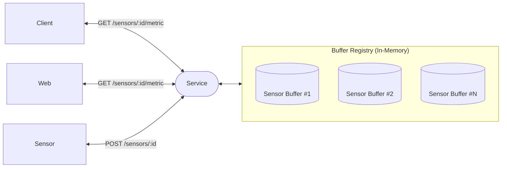
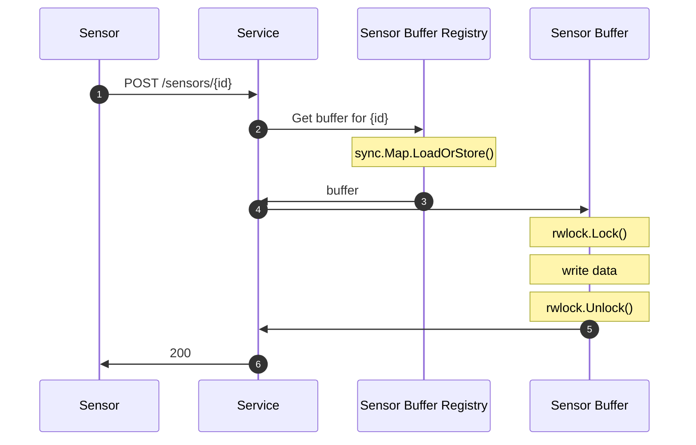
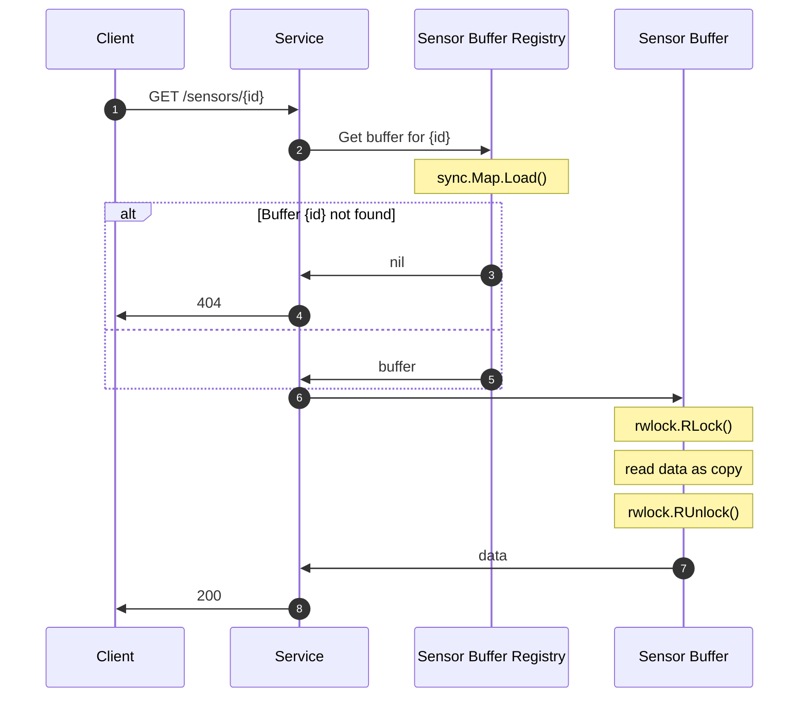
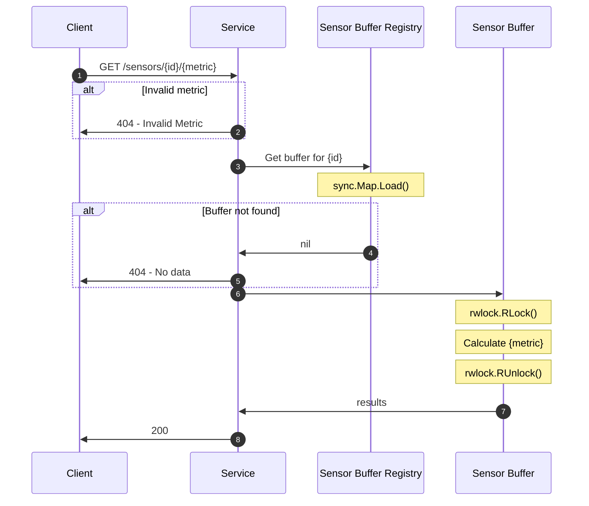

# Interview Prep 01

> This repository contains a small project I have constructed over the course of a weekend to prepare for an upcoming interview.
>
> **Start**: Friday, July 31, 2026
>
> **End**: Monday, August 3, 2026

## Overview

The following project documents the result of prompting Claude for help practicing for
an upcoming interview and then asking it to give me a project to work on as prep.

### Initial Prompt

i have a technical interview (2nd interview) for a role and have been laid off for a while.
can you help me
role is attached.

---

***Couple rounds of a mock interview w/ Claude later***

---

### Practice Project Prompt

give me a go proj for the weekend

### Story

Given exactly what tripped you today — long-running goroutine loops, single-consumer channel discipline, and a real REST API surface (their actual stack) — here's a project that hits all three without ballooning into a weekend-eating monster:

**Build a sensor telemetry service in Go**, close to the exact problem we just live-coded, but complete:

1. **Ingestion:** An HTTP endpoint (`POST /readings`) that accepts a `SensorReading` JSON body and pushes it onto a channel. This gets you real `net/http` reps, which is directly their stack.
2. **Processing:** A pool of per-sensor worker goroutines (spawned on-demand, like you designed today) that maintain a genuine sliding window — actual ring buffer this time, not a tumbling batch — and recompute a rolling average as each reading arrives.
3. **Query:** A `GET /sensors/{id}/average` endpoint that reads the current rolling average — this forces you to solve "how does an HTTP handler safely read state a goroutine is concurrently writing" (mutex-per-sensor, or a request/response channel pattern — pick one and be able to justify it).
4. **Shutdown:** Wire up `context.Context` for clean cancellation instead of the `<-readings` hack from earlier — spin it up with `context.WithCancel` in `main`, pass it through to your workers, handle `os.Interrupt` via `signal.NotifyContext`. This directly fixes the exact gap I flagged today.
5. **Tests:** Since you're TDD-minded, write the ring buffer and averaging logic test-first, before wiring up HTTP — good practice and gives you a concrete "here's tested code" artifact if it comes up.

Stretch, only if you've got extra time: swap the in-memory map for something that mimics their air-gapped/cloud story — e.g., an interface for storage with two implementations (in-memory vs. something pluggable), so you can talk about the config-driven deployment pattern you pitched Tuesday with actual code behind it, not just words.

Scope it to a few hours, not a full system — the goal is muscle memory on the specific patterns, not a finished product. Good luck this weekend.

## Architecture

> The following flowchart briefly describes the architecture of the service.



- A client or sensor will communicate over REST to the Go service.

- The service itself will buffer data POST by a sensor in a ring buffer.

  - The ring buffer capacity specified by a process argument, but defaults to 10.
  - I chose a ring buffer for its efficient use of space in time series like data where you only need the last N items.
  - buffers are only created once a sensor POSTs data to the service ensuring that there are never any empty buffers.

- The service will use a read-write mutex per ring buffer, this is because:

  - A read-write mutex will allow us to support many concurrent reads, and only blocking exclusively when writing data.
  - A read-write mutex per buffer allows each sensor and buffer to block independently of each other.

### Endpoints

I have created sequence diagrams so I can plan and document how the various
endpoints will work:

#### POST /sensors/{id}

> A sequence diagram for how the POST endpoint works



#### GET /sensors/{id}

> A Sequence diagram for how the GET sensor endpoint works

This endpoint returns all the buffered data for the sensor



#### GET /sensors/{id}/{metric}

> A sequence diagram for how the GET metric endpoint works

This endpoint returns the calculated value for the corresponding metric.

It supports the following metrics:

- average
- sum



## Building

```sh
go build
```

## Timeline

> A documented timeline of working sessions

|                   Start | End                     |                                                                                                                                                                                                                                                                                           Issue                                                                                                                                                                                                                                                                                          | Description                                                                                                                               |
|------------------------:|:------------------------|:----------------------------------------------------------------------------------------------------------------------------------------------------------------------------------------------------------------------------------------------------------------------------------------------------------------------------------------------------------------------------------------------------------------------------------------------------------------------------------------------------------------------------------------------------------------------------------------:|:------------------------------------------------------------------------------------------------------------------------------------------|
|   Sat, Aug 1st 2026 12p | Sat, Aug 1st 2026 2:15p |                                                                                                                                                                                                                                                               [#1](https://github.com/s0cks/sp-interview-prep-01/issues/1)                                                                                                                                                                                                                                                               | First Session.<br/>Working on:<br/><ul><li>initial project structure</li><li>architectural documents</li><li>and initial issues</li></ul> |
| Sat, Aug 1st 2026 3:00p | Sat, Aug 1st 2026 8:00p | [#2](https://github.com/s0cks/sp-interview-prep-01/issues/2), [#4](https://github.com/s0cks/sp-interview-prep-01/issues/4), [#5](https://github.com/s0cks/sp-interview-prep-01/issues/5), [#13](https://github.com/s0cks/sp-interview-prep-01/issues/13), [#12](https://github.com/s0cks/sp-interview-prep-01/issues/12), [#18](https://github.com/s0cks/sp-interview-prep-01/issues/18), [#15](https://github.com/s0cks/sp-interview-prep-01/issues/15), [#16](https://github.com/s0cks/sp-interview-prep-01/issues/16), [#17](https://github.com/s0cks/sp-interview-prep-01/issues/17) | Second Session.<br/>Working on:<br/><ul><li>REST api endpoints</li><li>Docker file</li><li>CI/CD actions</li></ul>                        |

## LICENSE

See [LICENSE](/LICENSE)

## Credits

- [Claude](https://claude.ai) --- For helping with practice, project idea and feedback.
