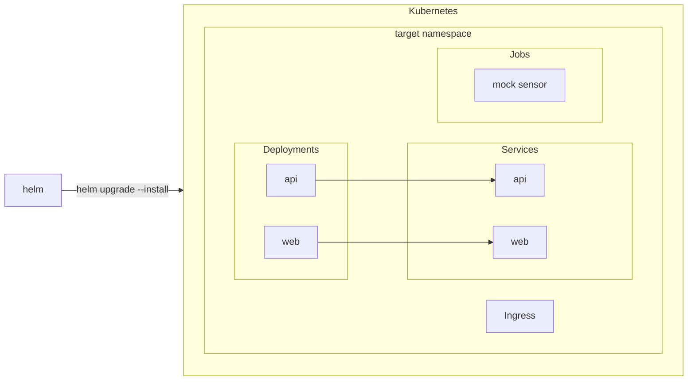

# Sensors helm chart

This [Helm](https://helm.sh/) chart deploys the entire stack to a [Kubernetes](https://kubernetes.io/) instance.

## Deploying

You can deploy this chart using the following commands

```sh
helm upgrade \
    --install
```

You can also check the rendered templates using the following command:

```sh
helm template .
```

### Resources Created

> Helm will create the following resources in Kubernetes depending on the configured values



#### The API Deployment & Service

This helm chart creates a deployment for the REST api, as well as a ClusterIP service.

#### The Web Deployment & Service

This helm chart creates a deployment for the web dashboard, as well as a ClusterIP service.

#### The Mock Sensor Job

The mock sensor completes as a one-off task and so helm will create a Kubernetes Job for the mock sensors.

#### The Ingress

> This chart does not support any other kind of Ingress besides [Traefik](https://traefik.io/traefik)
>
> You will need to supply your own if you would like to use something like nginx

By default this helm chart creates a single Ingress using Traefik and will leverage routing rules to distribute between
the api and web services.

## Configuring the Mock Sensor Job

You can configure the mock sensor job using the following `values.yaml`:

```yaml
...
mockSensor:
  enabled:       false # set to true enables the job deployment, false skips creating it.
  parallelism:   1     # how many instances of this job can be run in parallel
  completions:   1     # how many times does this job run
  backoffLimit:  5     # how many attempts for the job
  restartPolicy: Never # should it restart the job on failure?
...
```

## Configuring the Ingress

You can configure an Traefik Ingress by enabling it in the values.

```yaml
...
ingress:
  enable: true # or keep false if you want to skip creating the ingress
...
```
