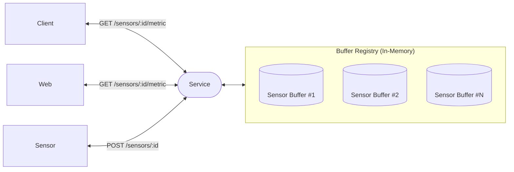
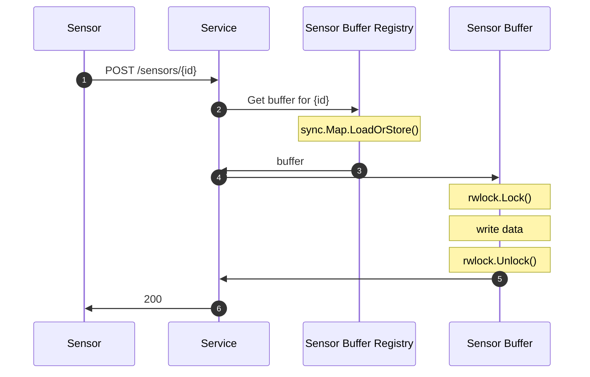
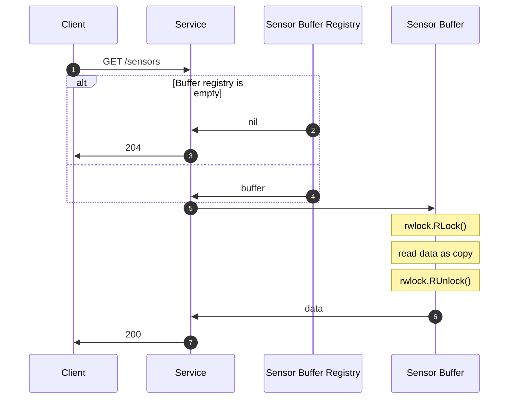
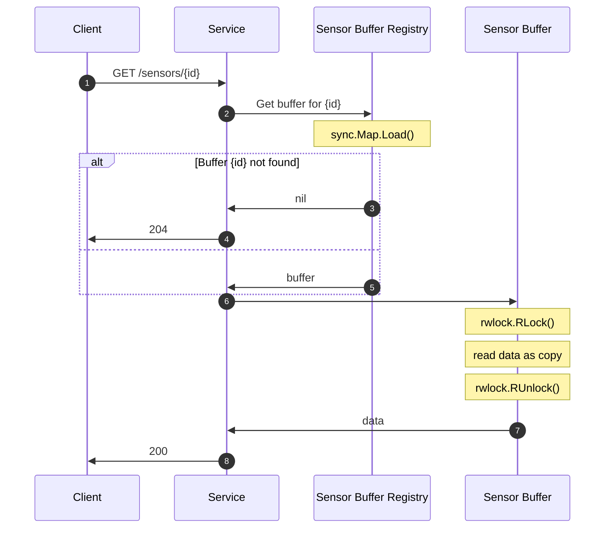
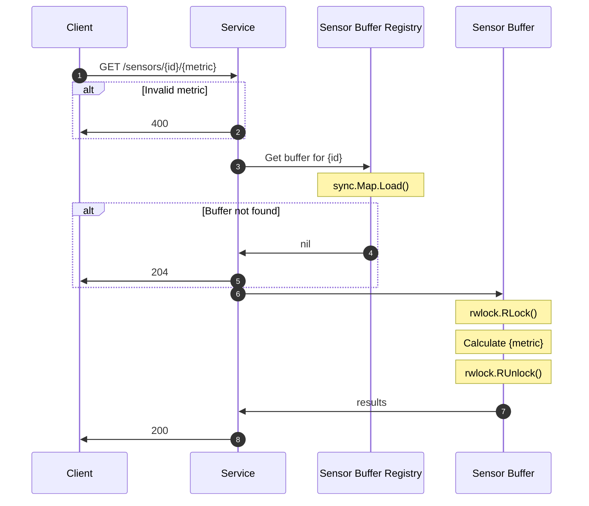

# Architecture

> The following flowchart briefly describes the architecture of the service.

- A client or sensor will communicate over REST to the Go service.

- The service itself will buffer data POST by a sensor in a ring buffer.

  - The ring buffer capacity specified by a process argument, but defaults to 10.
  - I chose a ring buffer for its efficient use of space in time series like data where you only need the last N items.
  - buffers are only created once a sensor POSTs data to the service ensuring that there are never any empty buffers.

- The service will use a read-write mutex per ring buffer, this is because:

  - A read-write mutex will allow us to support many concurrent reads, and only blocking exclusively when writing data.
  - A read-write mutex per buffer allows each sensor and buffer to block independently of each other.

## Endpoints

I have created sequence diagrams so I can plan and document how the various
endpoints will work:

### POST /sensors/{id}

> A sequence diagram for how the POST endpoint works

Sensors can post data for the service to ingest here

#### GET /sensors

> A Sequence diagram for how the GET sensor endpoint works

Returns a list of sensor ids

#### GET /sensors/{id}

> A Sequence diagram for how the GET sensor endpoint works

This endpoint returns all the buffered data for the sensor

#### GET /sensors/{id}/{metric}

> A sequence diagram for how the GET metric endpoint works

This endpoint returns the calculated value for the corresponding metric.

It supports the following metrics:

- average
- sum

We calculate the result on demand to improve ingestion time and provide flexibility and scaling for any future metrics.

